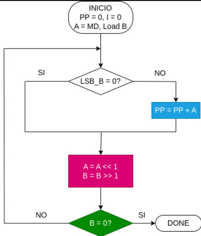
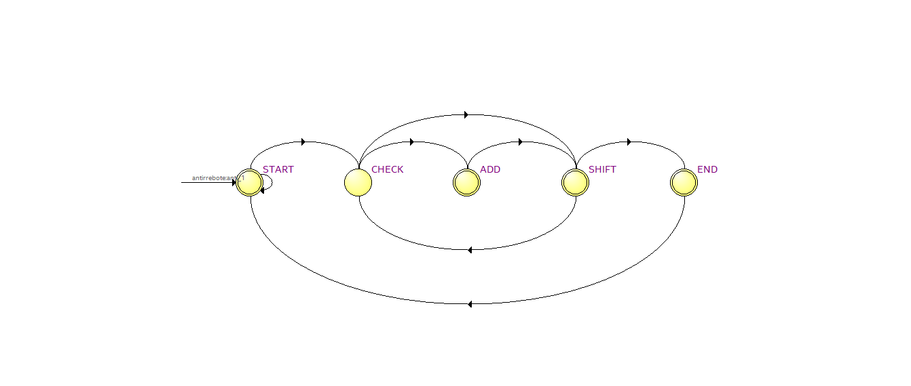
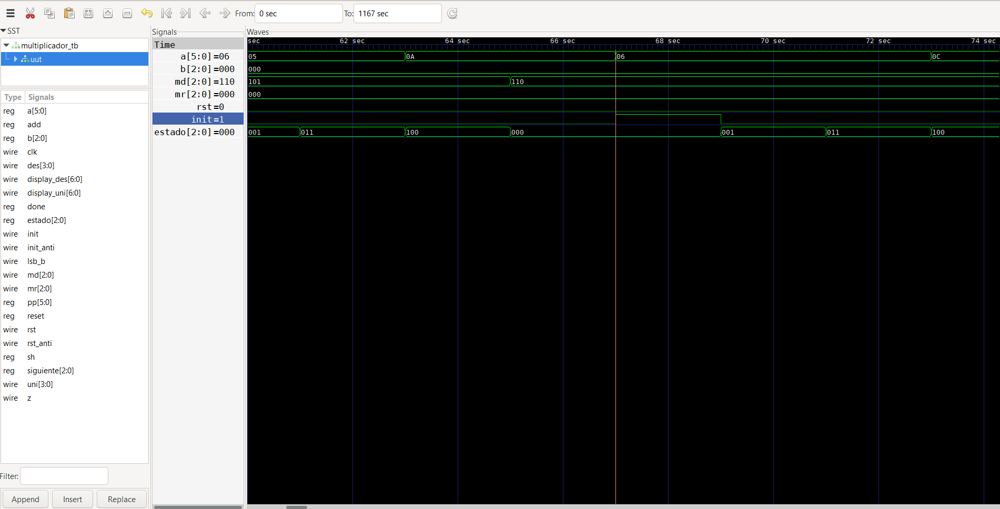
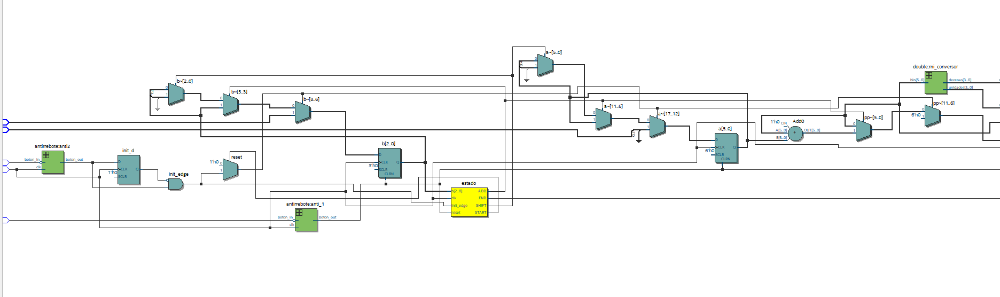
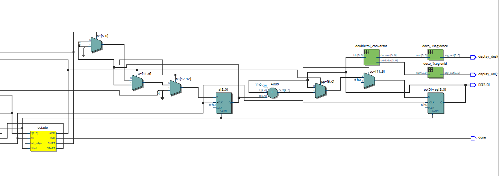

# Lab03: Multiplicador de 3 bits usando Máquina de Estados

## Integrantes
- [Edwin Albeiro Blanco](https://github.com/Edwinal05)
- [Cristian David Maldonado](https://github.com/CristianMaldonadoTinjaca)
- [Anderson Stiven Malagon](https://github.com/andersonstmalagonal-svg)

---

## Tabla de Contenidos
1. [Documentación](#1-documentación)
   - [antirrebote](src/antirrebote.v)
   - [deco_7seg](src/deco_7seg.v)
   - [double](src/double.v)
   - [multiplicador](src/multiplicador.v)
   - [multiplicadortb](src/multiplicadortb.v)
2. [Simulaciones](#2-simulaciones)
3. [Evidencias de implementación](#3-evidencias-de-implementación)
4. [Preguntas](#4-preguntas)
5. [Conclusiones](#5-conclusiones)
6. [Referencias](#6-referencias)

---

## 1. Documentación :

En esta sección se describen la estructura conceptual del algoritmo y los enlaces a los archivos Verilog que componen el sistema:

- **[antirrebote](src/antirrebote.v):** Filtra los rebotes mecánicos de los botones de reset e inicio antes de que lleguen a la FSM.
- **[deco_7seg](src/deco_7seg.v):** Decodificador combinacional para mostrar valores BCD en los displays de 7 segmentos de la FPGA.
- **[double](src/double.v):** Módulo que convierte el resultado binario a BCD (decenas y unidades) con el algoritmo *Double Dabble*.
- **[multiplicador](src/multiplicador.v):** Módulo principal (*Top*) que conecta la Máquina de Estados y el *Datapath*.
- **[multiplicadortb](src/multiplicadortb.v):** Banco de pruebas (*Testbench*) para simular las señales del sistema.

---

### Diagramas del Sistema

#### Diagrama de Bloques y Algoritmo
Representación conceptual del multiplicador y el flujograma de cómo se procesa la multiplicación secuencial por sumas y corrimientos:

#### Máquina de Estados Finita (FSM)
Estados por los que pasa la tarjeta (`START`, `CHECK`, `ADD`, `SHIFT`, `END`) y las salidas que activa en cada paso:

---

## 2. Simulaciones :

Corrimos la simulación en GTKWave para verificar la lógica antes de compilar en la FPGA. Se observa cómo el registro `estado` va cambiando secuencialmente, mientras que `a` y `b` se van desplazando y guardando el valor correcto en el registro del producto acumulado `pp`:

---

## 3. Evidencias de implementación :

Sintetizamos el proyecto en Quartus para revisar cómo se conectaron físicamente los módulos por dentro:

| Esquemático RTL General Entrada | Esquemático RTL General Salida |
| :---: | :---: |
|  |  |

---

## 4. Preguntas :

1. **¿Cómo se entienden la FSM y el Datapath en esta práctica?**
   - La FSM funciona como el "cerebro" que da las órdenes (`reset`, `add`, `sh`), y el *Datapath* es la "calculadora" que ejecuta las sumas y desplazamientos. La FSM revisa dos señales del *Datapath*: si el bit menos significativo de $B$ es 1 (`lsb_b`) y si $B$ ya llegó a cero (`z`) para saber si continua o termina la multiplicación.

2. **¿Por qué usamos el módulo `double.v` en vez de mostrar los datos directamente?**
   - El resultado del producto `pp` es un número binario de 6 bits (hasta 63). Los displays de la FPGA leen formato BCD dígito por dígito. El módulo `double.v` usa el algoritmo *Double Dabble* para separar de forma rápida esos 6 bits en un bloque de 4 bits para decenas y otro de 4 bits para unidades.

3. **¿Qué ventaja le vemos a usar un multiplicador por estados frente a uno combinacional?**
   - Que ahorramos espacio en la FPGA. Un multiplicador combinacional directo arma una red gigante de sumadores. En cambio, con la FSM reciclamos el mismo sumador básico una y otra vez usando desplazamientos en varios ciclos de reloj.

---

## 5. Conclusiones :

- Comprobamos que el método de multiplicación secuencial por sumas y corrimientos reduce el área de hardware necesaria en la FPGA comparado con un diseño puramente combinacional.
- La separación entre la unidad de control (FSM) y la de proceso (*Datapath*) hace que el código Verilog sea mucho más ordenado, fácil de simular y de corregir.
- Se verificó la utilidad de agregar bloques complementarios como `antirrebote.v` y `double.v`, ya que sin ellos la lectura en la FPGA real sería inestable por el rebote de los pulsadores o ilegible en los displays.

---

## 6. Referencias :

- Guía de laboratorio: *Lab03 - Multiplicador de 3 bits usando Máquina de Estados*.
- Charles H. Roth Jr., *Digital Systems Design Using Verilog*, Cengage Learning.
- Documentación de Icarus Verilog y GTKWave.
