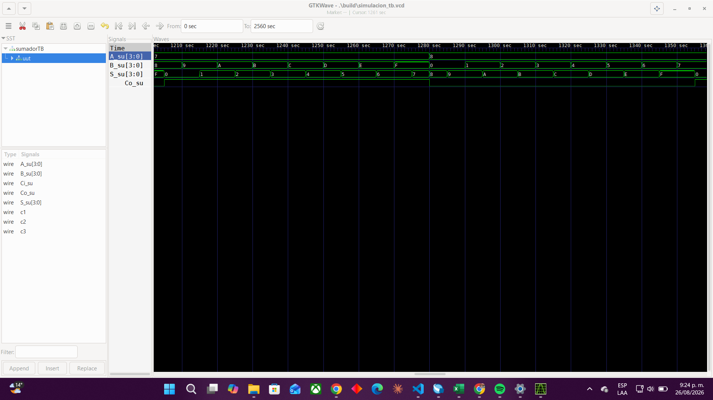
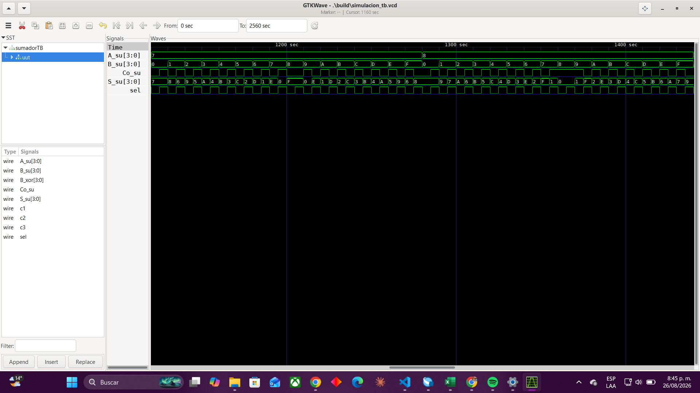

        
# Lab01 - Sumador/Restador de 4 bits

# Integrantes
    * [<!-- EDWIN ALBEIRO BLANCO. -->](<!-- Remplace aqui link de usario 1 de github -->) 
    * [<!-- CRISTIAN DAVID MALDONADO. -->](https://github.com/CristianMaldonadoTinjaca) 
    * [<!-- ANDERSON STIVEN MALAGON. -->](https://github.com/andersonstmalagonal-svg) 
# Informe

Indice:

1. [Documentación](#documentación-de-los-circuitos-implementados-implementado)
   - [sumador_1_bit](#sumador_1_bit)
   - [sumador_4_bit](#sumador_4_bits)
   - [sumador_restador_4_bits](#Sumador/Restador)
2. [Simulaciones](#simulaciones)
3. [Evidencias de implementación](#evidencias-de-implementación)
4. [Preguntas](#preguntas)
5. [Conclusiones](#conclusiones)
6. [Referencias](#referencias)

## 1 Documentación del diseño implementado
### 1. sumador_1_bit
# Sumador Completo de 1 Bit (1-bit Full Adder)

## Descripción General
El **sumador completo de 1 bit** es un circuito combinacional fundamental en la arquitectura de procesadores. Realiza la suma aritmética de dos bits de entrada ($A$ y $B$), tomando en cuenta un bit de acarreo de entrada ($C_{sel}$) proveniente de un nivel o etapa anterior. Genera dos salidas: la suma ($S$) y el acarreo de salida ($C_{out}$).

## Diagrama de Bloques e Interfaz

### Entradas y Salidas
| Puerto | Tipo | Descripción |
| :---: | :---: | :--- |
| `A` | Entrada | Primer bit de entrada a sumar. |
| `B` | Entrada | Segundo bit de entrada a sumar. |
| `Sel` | Entrada | Acarreo de entrada (*Carry-in*). |
| `S` | Salida | Resultado de la suma (*Sum*). |
| `Cout` | Salida | Acarreo de salida (*Carry-out*). |

---

## Tabla de Verdad

| $A$ | $B$ | $C_{Cin}$ | $S$ (Suma) | $C_{out}$ (Acarreo) |
| :-: | :-: | :------: | :--------: | :-----------------: |
|  0  |  0  |    0     |     0      |          0          |
|  0  |  0  |    1     |     1      |          0          |
|  0  |  1  |    0     |     1      |          0          |
|  0  |  1  |    1     |     0      |          1          |
|  1  |  0  |    0     |     1      |          0          |
|  1  |  0  |    1     |     0      |          1          |
|  1  |  1  |    0     |     0      |          1          |
|  1  |  1  |    1     |     1      |          1          |

---

## Ecuaciones Boleanas

Las expresiones lógicas simplificadas para las salidas son las siguientes:

* **Suma ($S$):**
  $$S = A \oplus B \oplus C_{in}$$

* **Acarreo de salida ($C_{out}$):**
  $$C_{out} = (A \cdot B) + (C_{in} \cdot (A \oplus B))$$

### Código Implementado 
* [Sumador de 1 bit](./src/Sumador_1_bit).

  -----------------------------------------------------------------------------------------------------------------------------------------------
### 1.2 sumador_4_bits

# Sumador de 4 Bits (Ripple Carry Adder)

## Descripción General
Un **Sumador de 4 Bits** es un circuito combinacional capaz de sumar dos números binarios de 4 bits cada uno ($A$ y $B$), además de considerar un acarreo inicial de entrada ($C_{in}$). El circuito genera un resultado de 4 bits para la suma ($S$) y un bit final de acarreo de salida ($C_{out}$).

Esta implementación se basa en la arquitectura de **acarreo en cascada (Ripple Carry)**, conectando en serie 4 sumadores completos de 1 bit.

---

## Interfaz de Entradas y Salidas

| Puerto | Ancho de Bits | Tipo | Descripción |
| :---: | :---: | :---: | :--- |
| `A` | 4 bits ($A_3, A_2, A_1, A_0$) | Entrada | Primer operando de 4 bits. |
| `B` | 4 bits ($B_3, B_2, B_1, B_0$) | Entrada | Segundo operando de 4 bits. |
| `Cin` | 1 bit | Entrada | Acarreo inicial de entrada. |
| `S` | 4 bits ($S_3, S_2, S_1, S_0$) | Salida | Resultado de la suma. |
| `Cout` | 1 bit | Salida | Acarreo final de salida (Desbordamiento de 4 bits). |

---

## Principio de Funcionamiento

El circuito interconecta cuatro módulos **Sumadores Completo de 1 bit** ($FA_0, FA_1, FA_2, FA_3$):

1. **Bit 0 (LSB):** $FA_0$ suma los bits menos significativos $A_0$ y $B_0$ con el acarreo de entrada $C_{in}$, generando la suma $S_0$ y el acarreo intermedio $C_1$.
2. **Bit 1:** $FA_1$ suma $A_1$ y $B_1$ utilizando el acarreo $C_1$, generando $S_1$ y el acarreo $C_2$.
3. **Bit 2:** $FA_2$ suma $A_2$ y $B_2$ utilizando el acarreo $C_2$, generando $S_2$ y el acarreo $C_3$.
4. **Bit 3 (MSB):** $FA_3$ suma los bits más significativos $A_3$ y $B_3$ utilizando el acarreo $C_3$, generando la suma $S_3$ y el acarreo final $C_{out}$.

---

## Ejemplos de Funcionamiento Aritmético

* **Caso 1: Suma simple sin acarreo final**
  * $A = 0101_2$ (5 en decimal)
  * $B = 0011_2$ (3 en decimal)
  * $C_{in} = 0$
  * **Resultado:** $S = 1000_2$ (8 en decimal), $C_{out} = 0$

* **Caso 2: Suma con acarreo final (Desbordamiento de 4 bits)**
  * $A = 1100_2$ (12 en decimal)
  * $B = 0101_2$ (5 en decimal)
  * $C_{in} = 0$
  * **Resultado:** $S = 0001_2$ (1 en decimal), $C_{out} = 1$ *(Suma total = 17)*

## Codigo Implementado
* [Sumador de 4 bits](./src/sumador_4_bits)
----------------------------------------------------------------------------------------------------------------------------------------------------------------

### 1.2 Sumador/Restador
# Sumador-Restador de 4 Bits

## Descripción General
Un **Sumador-Restador de 4 Bits** es un circuito combinacional versátil capaz de realizar tanto sumas como restas aritméticas en sistema binario de complemento a dos. El modo de operación se selecciona mediante una señal de control ($Op$).

El circuito utiliza la misma estructura base de un sumador de 4 bits mediante el uso de compuertas **XOR** en las entradas del segundo operando ($B$), lo que permite invertir sus bits cuando se requiere una operación de resta.

---

## Interfaz de Entradas y Salidas

| Puerto | Ancho de Bits | Tipo | Descripción |
| :---: | :---: | :---: | :--- |
| `A` | 4 bits ($A_3..A_0$) | Entrada | Primer operando (Minuendo / Augendo). |
| `B` | 4 bits ($B_3..B_0$) | Entrada | Segundo operando (Sustraendo / Sumando). |
| `Op` | 1 bit | Entrada | Selector de operación (`0` = Suma, `1` = Resta). |
| `Result` | 4 bits ($R_3..R_0$) | Salida | Resultado de la operación ($A + B$ o $A - B$). |
| `Cout` | 1 bit | Salida | Acarreo de salida o préstamo según la operación. |

---

## Principio de Funcionamiento

El circuito se apoya en las propiedades de la compuerta **XOR** como inversor controlado:

1. **Modo Suma ($Op = 0$):**
   * Cada bit $B_i \oplus 0 = B_i$ (el valor de $B$ no cambia).
   * El acarreo inicial de entrada es $C_{in} = 0$.
   * La operación ejecutada es: $\text{Result} = A + B$.

2. **Modo Resta ($Op = 1$):**
   * Cada bit $B_i \oplus 1 = \overline{B_i}$ (se invierten todos los bits de $B$, obteniendo el complemento a 1).
   * El acarreo inicial de entrada es $C_{in} = 1$ (sumando este $1$ se completa el **complemento a 2**).
   * La operación ejecutada es: $\text{Result} = A + \overline{B} + 1 = A - B$.

---

## Estructura Interna por Etapa

Para cada bit $i$ (donde $i = 0, 1, 2, 3$):

* **Entrada Modificada:** $B'_i = B_i \oplus Op$
* **Suma / Resta por Bit:** $R_i = A_i \oplus B'_i \oplus C_i$
* **Acarreo Siguiente:** $C_{i+1} = (A_i \cdot B'_i) + (C_i \cdot (A_i \oplus B'_i))$

*(Nota: $C_0 = Op$)*

---

## Ejemplos de Funcionamiento

* **Ejemplo 1: Suma ($Op = 0$)**
  * $A = 0110_2$ (6 en decimal)
  * $B = 0011_2$ (3 en decimal)
  * **Resultado:** $\text{Result} = 1001_2$ (9 en decimal), $C_{out} = 0$

* **Ejemplo 2: Resta ($Op = 1$)**
  * $A = 0111_2$ (7 en decimal)
  * $B = 0010_2$ (2 en decimal)
  * **Resultado:** $\text{Result} = 0101_2$ (5 en decimal), $C_{out} = 1$

---

## Código Implementado 

Simulación en GTKWave del módulo sumador. Se observa cómo la señal de salida S_su[3:0] realiza la suma en hexadecimal de los operandos A_su[3:0] y B_su[3:0]. Por ejemplo, cuando A_su cambia a 8 y B_su incrementa consecutivamente desde 0 hasta F, el resultado S_su responde dinámicamente de forma correcta (8 + 0 = 8, 8 + 1 = 9, 8 + 2 = A, etc.).

* [Restador de 4 bits](./src/Restador_4_bits)

--------------------------------------------------------------------------------------------------
## Simulaciones 
### sumador_4_bits

Simulación en GTKWave del módulo sumador. Se observa cómo la señal de salida S_su[3:0] realiza la suma en hexadecimal de los operandos A_su[3:0] y B_su[3:0]. Por ejemplo, cuando A_su cambia a 8 y B_su incrementa consecutivamente desde 0 hasta F, el resultado S_su responde dinámicamente de forma correcta (8 + 0 = 8, 8 + 1 = 9, 8 + 2 = A, etc.).

* 

### restador_4_bits 

Simulación en GTKWave del circuito sumador/restador. Se observa la señal de control sel, la cual conmuta la operación realizada sobre los operandos A_su[3:0] y B_su[3:0]. Al cambiar el estado de sel, la salida S_su[3:0] pasa dinámicamente de entregar la suma ($A + B$) a entregar la resta en complemento a dos ($A - B$), validando la lógica del módulo.
* 
-------------------------------------------------------------------

## Evidencias de implementaciónEn 
el siguiente video podemos ver el sumador y el restador trabajando juntos. Mediante un pulsador cambiamos entre la suma y la resta, mientras que con unos conmutadores (switches) ajustamos la entrada de 4 bits, tanto para la entrada A como para la B. La salida se muestra en formato binario mediante LEDs
https://youtube.com/shorts/MP581d7l8P0?si=btuJHzmaOGTZkvLG

## Conclusiones

## Referencias

